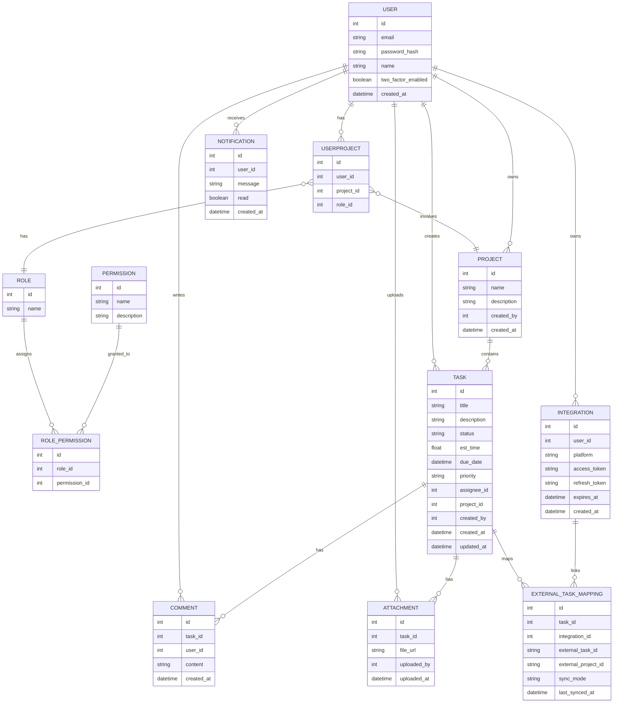

# 📘 Task Sync System - ERD (Mermaid Diagram with Role Permission)

```mermaid
erDiagram
    USER ||--o{ USERPROJECT : has
    USERPROJECT }o--|| PROJECT : involves
    USERPROJECT }o--|| ROLE : has

    ROLE ||--o{ ROLE_PERMISSION : assigns
    PERMISSION ||--o{ ROLE_PERMISSION : granted_to

    USER ||--o{ TASK : creates
    USER ||--o{ COMMENT : writes
    USER ||--o{ ATTACHMENT : uploads
    USER ||--o{ INTEGRATION : owns
    USER ||--o{ NOTIFICATION : receives
    USER ||--o{ PROJECT : owns

    PROJECT ||--o{ TASK : contains

    TASK ||--o{ COMMENT : has
    TASK ||--o{ ATTACHMENT : has
    TASK ||--o{ EXTERNAL_TASK_MAPPING : maps

    INTEGRATION ||--o{ EXTERNAL_TASK_MAPPING : links

    USER {
        int id
        string email
        string password_hash
        string name
        boolean two_factor_enabled
        datetime created_at
    }

    ROLE {
        int id
        string name
    }

    PERMISSION {
        int id
        string name
        string description
    }

    ROLE_PERMISSION {
        int id
        int role_id
        int permission_id
    }

    USERPROJECT {
        int id
        int user_id
        int project_id
        int role_id
    }

    PROJECT {
        int id
        string name
        string description
        int created_by
        datetime created_at
    }

    TASK {
        int id
        string title
        string description
        string status
        float est_time
        datetime due_date
        string priority
        int assignee_id
        int project_id
        int created_by
        datetime created_at
        datetime updated_at
    }

    COMMENT {
        int id
        int task_id
        int user_id
        string content
        datetime created_at
    }

    ATTACHMENT {
        int id
        int task_id
        string file_url
        int uploaded_by
        datetime uploaded_at
    }

    INTEGRATION {
        int id
        int user_id
        string platform
        string access_token
        string refresh_token
        datetime expires_at
        datetime created_at
    }

    EXTERNAL_TASK_MAPPING {
        int id
        int task_id
        int integration_id
        string external_task_id
        string external_project_id
        string sync_mode
        datetime last_synced_at
    }

    NOTIFICATION {
        int id
        int user_id
        string message
        boolean read
        datetime created_at
    }
```